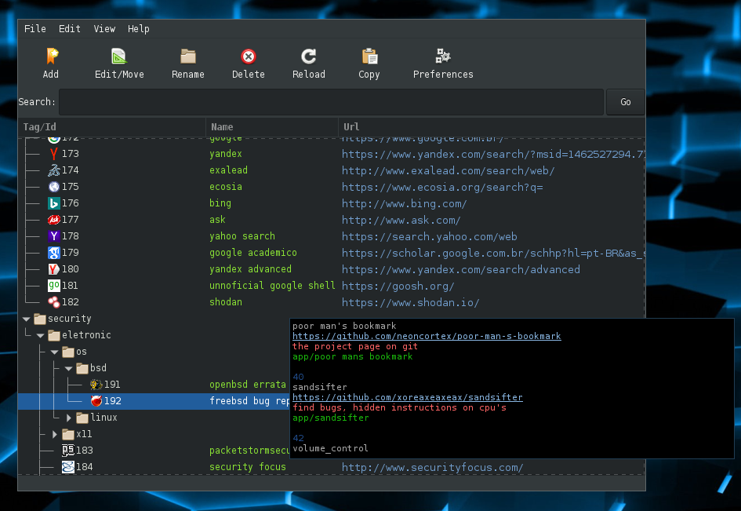

**pmb** is a bookmark management tool for those who want more power and flexibility
in bookmark management.

A bookmark inside pmb will have 6 fields:

  	   id	      = unique identifier

	   name	      = name of the website

	   url	      = url of the website

	   comment    = a comment about it [optional]

	   tag	      = a tag [optional]

	   favicon    = a favicon [optional]

Tags are used to group bookmarks together, then you can operate on groups of
bookmarks easily.

**Databases:**

	The default database file are ~/.config/pmb/bookmarks.db. You can point another
	database with -f option.

	pmb -f ~/xyz.db

	pmb uses sqlite3 to manage databses.

**Examples:**

*Adding a bookmark:*

	pmb -a name=example,url="http://example.com",comment="my example",tag=ex

	comment and tag can be ommited, they be set to 'none' on database
	if you do not specify any value.

	pmb -a name=example,url="http://example.com"

*Printing.*

	pmb -p all

	Will print all bookmarks.

	pmb -p i=10

	Will print bookmark who have id 10;

	pmb -p=10,field=url

	Will print the field url of the bookmark
	who have id 10.

*Search by database by name, url, comment and tag.*

	pmb -s name=linux 

	Will search all database for bookmarks who  have
	linux in name and print it, same for other field's.
	If you do not specify a field, it will search all
	fields:

	pmb -s linux	

*Exporting the search result.*

	pmb -s linux,e=xyz.db

	Will export the result of the search to the database
	xyz.db (if xyz.db do not exist, it will be created).

*Deleting the search result.*

	pmb -s linux,d
	pmb -s name=linux,d
	...

	Will delete the result of the search from database.

*Edit bookmarks by id or field.*

	pmb -e id=10,tag="new value"

	Will set tag of the bookmark who have id number 10
	to "new value".

	pmb -e f=tag,value="old value",new-value="new value"

	Will set tag of the bookmarks who have tag with 
	value "old tag" to value "new value".
	
*Deleting.*

	pmb -d id=10

	Wll delete bookmark who have id 10.

	pmb -d tag=value

	Will delete any bookmark tagged with "value"

	pmb -d tag=value,g

	Will delete any bookmark that contain the word
	"value" in the tag field.
		
*Colored output.*

	pmb -c -p all
	pmb -s linux -c

	Adding -c will make search output and print output colored.	

	You can also set the colors with -l [--colors]

	pmb -s xyz -l comment=red

*Load a config file.*
	
	pmb -C ~/.my_config_file.conf

	pmb will automatically look for ~/.config/pmb/pmb.conf file.
	
	For now we do have those options:
		color=(0|1)
		verbose=(0|1)
		id_color=color
		name_color=color
		url_color=color
		comment_color=color
		tag_color=color

	It does not understand spaces between name and value, for
	example: 
		color = 1

	It will not be interpreted, it should be:
		color=1

And more =D

**Depends**

	* sqlite3

	* gtk3

	* curl

**Build dependencies:**

	* libsqlite3-dev
	
	* libgtk-3-dev 
	
	* libcurl4-openssl

	To build, just clone the repository, cd to it and type make

**TODO:**

	* Allow keybind customization to Gtk interface.

	* And a lot more ...

I'm writing it in linux and do not know if it will run into other platforms.
